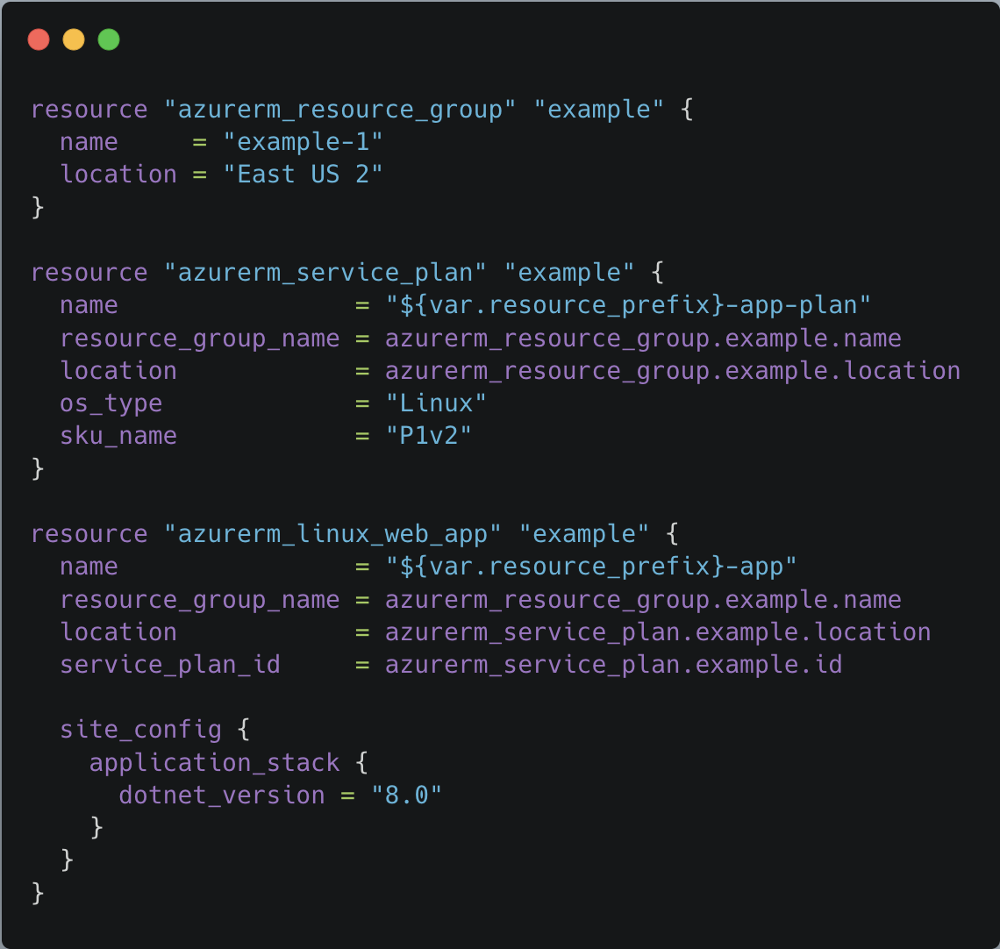
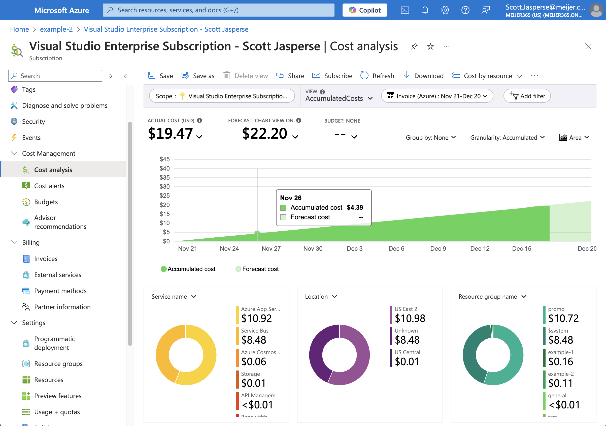

# Azure VSE Subscription 
# + Terraform

by Scott Jasperse

---

## Azure "VS Enterprise" Subscription

- Setup via https://my.visualstudio.com
- $150/mo. credit with a hard stop. No way to get in trouble for over-use.
- Full administrator
- Part of company tenant - so you can grant other developers permission to see your stuff.
- Not all resource providers are registered by default.

---


## Terraform

- Built by HashiCorp
- Many "Providers" created by 3rd parties.
  - Azure, AWS, GCP, DigitalOcean, Kubernetes...
- Is not a "one configuration, multiple cloud" solution.

---

## Terraform - Why?

- Infrastructure-as-Code
  - Version trackable, repeatable, auditable
- Keep track of what worked, without needing to keep the resources around.
- Can create, and destroy on demand.
- Use infrastructure to inject configuration, so you don't have to configure it manually.


---

## Terraform - Why?


- Feel the god-like powers flow through your terminal.


---

## Before we get started....

- Create a `env.tfvars` file in the root of your repo.
- Scripts are in powershell. 
  - You may need to run `Set-ExecutionPolicy Unrestricted` from an administrative session.
- You will probably need to enable "Resource providers" in you Azure Subscription. 
  - `./Register-Providers.ps1` may help
- I tested all this on a mac, but I tried to make everything cross-platform.
---

## Example 1

Simple example for a hello world app deployed to Azure.


Commands you may need:
```sh
 > Set-ExecutionPolicy Unrestricted
 > ./Register-Providers.ps1
 infrastructure> terraform init
 infrastructure> terraform apply -var-file="../../env.tfvars"
 > ./deploy.ps1
```

---

## Example 2

Simple web app, connected to Cosmos, using Key Vault, and User-Managed Identity for key vault access.

Commands you may need:
```sh
 infrastructure> terraform init
 infrastructure> terraform apply -var-file="../../env.tfvars"
 > ./deploy.ps1
```

----

## Example 3

`3a` Is only a log analytics workspace.

`3b` Simple web app infrastructure, deployed to 2 environments.


Commands you may need:
```sh
 infrastructure> terraform init
 infrastructure> terraform apply -var-file="../../env.tfvars"
 > ./deploy.ps1
```

---
## Azure Subscription- Cost Analysis



